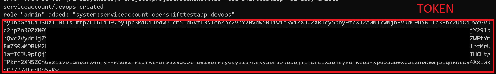

OpenShiftTestApp
=========================

- [Installation Prerequisites](#installation-prerequisites)
- [Installation](#installation)
- [Introduction](#introduction)
- [Features](#features)
- [Contribute](#contribute)
- [Author](#author)


## Installation Prerequisites

- Use [Set up your Azure Red Hat OpenShift dev environment](https://docs.microsoft.com/en-us/azure/openshift/howto-setup-environment) tutorial to prepare your environment.

- Use [Create an Azure Red Hat OpenShift cluster](https://docs.microsoft.com/en-us/azure/openshift/howto-setup-environment) tutorial to create your own OpenShift cluster in Azure.

- Use [Create a private container registry](https://docs.microsoft.com/en-us/azure/container-registry/container-registry-get-started-azure-cli) tutorial to create your own private container registry in Azure. 

- Enable [Admin account](https://docs.microsoft.com/en-us/azure/container-registry/container-registry-authentication#admin-account) and save its credentials for further use.


## Installation

### Step 1

Using [OpenShift CLI](https://docs.microsoft.com/en-us/azure/openshift/tutorial-create-cluster#step-5-install-the-openshift-cli) create a project and a service account in the cluster.

#### NOTE 
Before continue please ensure that you have successfully logged into your cluster ([Get the sign in URL for your cluster](https://docs.microsoft.com/en-us/azure/openshift/tutorial-create-cluster#get-the-sign-in-url-for-your-cluster)):

```bash
oc login --server=[CLUSTER_URL]
```

After you logged in:

`create_project_and_serviceaccount.sh` creates everything automatically.

Alternatively you can run the same manually:

- Create a project:

```bash
oc new-project openshifttestapp
```

- Create a service account for deployment:

```bash
oc create serviceaccount devops
oc policy add-role-to-user admin system:serviceaccount:openshifttestapp:devops
oc serviceaccounts get-token devops
```

#### TOKEN
Save the token you obtained after the last command. You will need it later.




### Step 2

The last part is to setup environment variables in your deployment pipelines.

Both [Azure Pipelines Secrets](https://docs.microsoft.com/en-us/azure/devops/pipelines/process/variables#secret-variables) and [GitHub Actions Secrets](https://help.github.com/en/actions/automating-your-workflow-with-github-actions/creating-and-using-encrypted-secrets#creating-encrypted-secrets) use the same subset of environment variables:

| VARIABLE NAME | VALUE |
| ----------| ----------- |
| CONNECTIONSTRING | Server=localhost; Database=MvcOSTAContext; user id=sa; password=*YOUR_DB_PASSWORD*; |
| DATABASENAME | MvcOSTAContext |
| DATABASEPASSWORD | *YOUR_DB_PASSWORD* |
| DATABASEUSER | sa |
| REGISTRY_NAME | The private registry name you used [here](https://docs.microsoft.com/en-us/azure/container-registry/container-registry-get-started-azure-cli#create-a-container-registry) |
| REGISTRY_USERNAME | Username of [Admin account](https://docs.microsoft.com/en-us/azure/container-registry/container-registry-authentication#admin-account) 
| REGISTRY_PASSWORD | Password of [Admin account](https://docs.microsoft.com/en-us/azure/container-registry/container-registry-authentication#admin-account) |
| OCTOKEN | [Token of `devops` service account](#token) |
| OCURL | [Get the sign in URL for your cluster](https://docs.microsoft.com/en-us/azure/openshift/tutorial-create-cluster#get-the-sign-in-url-for-your-cluster) |


### Step 3

After all the [environment variables](#step-2) are setted up, run the pipeline or just make a commit to the master brunch. 

After the pipeline is successfully finished, run the below command to obtain a public facing URL of the application:

```bash
echo http://$(oc get route openshifttestapp-application-route -o jsonpath="{.status.ingress[0].host}")
```


## Introduction 

This is a very basic example of `ASP.NET Core MVC + EF Core application` runned on [an OpenShift cluster](https://docs.microsoft.com/en-us/azure/openshift/) along with [a containerized MSSQL database](https://docs.microsoft.com/en-us/sql/linux/quickstart-install-connect-docker).

It also demonstrates how to use both [Azure Pipelines](https://docs.microsoft.com/en-us/azure/devops/pipelines/) and [GitHub Actions](https://help.github.com/en/actions) to build and deploy .NET Core applications directly to an OpenShift cluster.

:rotating_light: **IMPORTANT:** This project is a Proof of Concept and provided AS IS. The only purpose this project is to demonstrate a working concept. **PLEASE DO NOT USE THIS PROJECT IN YOUR PRODUCTION ENVIREMENT!**

:rotating_light: **IMPORTANT:** This project ships with many references to third party dependencies, verisons of wich are not controlled. Build and deployment pipelines may fail in many cases of backward compatibility breaks, network and other availability issues. **PLEASE DO NOT USE THIS PROJECT IN YOUR PRODUCTION ENVIREMENT!**

:rotating_light: **IMPORTANT:** This example uses sa user (Server Administrator) to connect to a database. This is only on purpose to simplify the demo case. **PLEASE DO NOT USE THE SA USER IN YOUR PRODUCTION ENVIREMENT!**


## Features

- Azure Pipelines and GitHub Actions
- Docker and OpenShift
- Containerized MSSQL database
- EF Core Migrations


## Contribute

Contributions to the package are always welcome!

* Report any bugs or issues you find on the [issue tracker](https://github.com/denisyfrolov/OpenShiftTestApp/issues/new).


## Author

* [Denis Y Frolov](https://twitter.com/denisyfrolov)